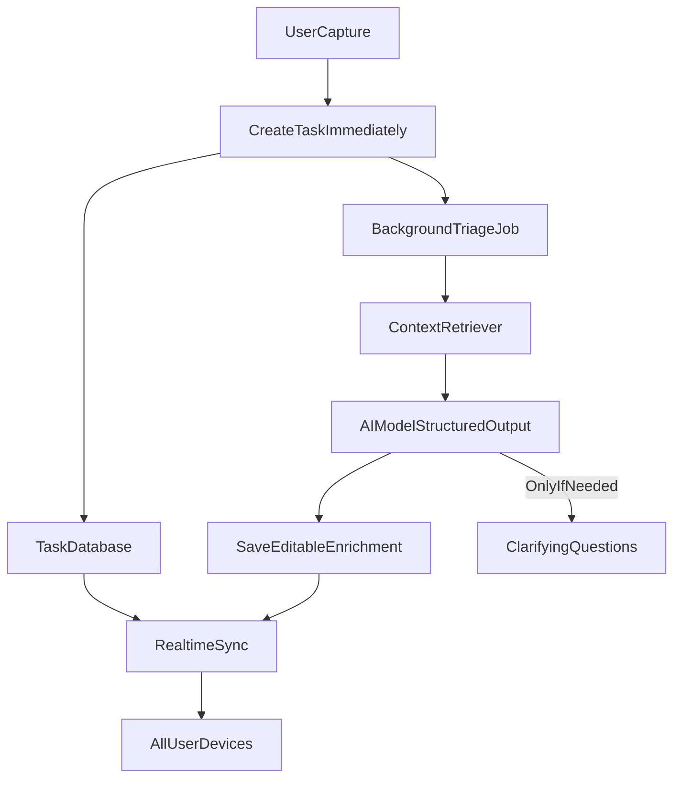

# Sifty MVP Plan

## Direction

Because `/Users/santigarza/work/sifty` is currently empty, start with a focused greenfield app rather than a full native/web multi-platform build. The fastest high-quality path is a responsive Next.js App Router PWA that works on work laptop, personal laptop, and iPhone through the browser, with a backend designed so native apps can be added later without changing the core product model.

Default stack:

- Next.js App Router + TypeScript in [`app/`](app/) and [`components/`](components/)
- Tailwind + shadcn/ui using Radix primitives, dark-first calm product UI, no emoji UI copy
- Supabase Postgres + realtime subscriptions for task sync across devices
- Supabase Auth or Clerk depending on install preference; default to Supabase Auth if prioritizing fastest realtime integration
- Drizzle or Supabase typed client for schema-safe data access
- Vercel AI SDK through AI Gateway for structured AI triage
- Stripe subscriptions, with creator bypass configured by `CREATOR_EMAIL=s.gonzalez.garza@gmail.com`
- Background triage jobs via a durable queue/worker path so task capture never blocks on model latency

## Product Shape

The first shippable version should optimize for fast capture and trusted automatic organization:

- A single primary capture action available everywhere, with one flexible input for the task and optional context/instructions.
- Immediate task creation in an `inbox`/`processing` state, followed by non-blocking AI enrichment.
- AI output saved as editable structured fields: title, description, next actions, subtasks, labels, area, urgency, importance, effort size, delegation candidate, due hints, confidence, and optional clarifying questions.
- A calm dashboard organized by actionable views rather than a literal admin board: Today, Focus, Waiting/Delegated, Someday, and Inbox.
- Progressive disclosure: list rows stay compact; details, subtasks, AI reasoning, and edits live in a detail sheet or page.
- Mobile-first capture and review, desktop-friendly keyboard navigation and command palette.

Core data flow:

## Implementation Plan

1. Bootstrap the app in [`/Users/santigarza/work/sifty`](/Users/santigarza/work/sifty) with Next.js, TypeScript, Tailwind, shadcn/ui, Biome, and baseline scripts for `pnpm biome check --write` and `pnpm tsc --noEmit`.
2. Add the app shell: authenticated layout, responsive sidebar/bottom nav, primary capture button, task list views, task detail sheet, loading/retry/error states, and empty states that stay silent unless action is required.
3. Define the database model around first-class productivity concepts: users, profiles/preferences, tasks, subtasks, labels, task events, AI triage runs, memories, subscription entitlements, and optional agent runs.
4. Implement auth and entitlements: creator account is permanently unlimited/free, other users get a 30-day trial and usage-limited AI access until a Stripe subscription is active.
5. Build capture and realtime sync: create tasks synchronously, subscribe clients to task updates, and show enrichment progress without blocking input.
6. Build the AI triage pipeline with schema-validated structured output. The prompt should apply GTD next-action extraction, Eisenhower urgency/importance, effort sizing, delegation detection, and user-specific preferences/memory.
7. Add persistent memory and dynamic context retrieval in a simple first version: store explicit preferences, accepted/rejected AI edits, task history summaries, labels/areas, and recent active work; retrieve a small bounded context package per triage job.
8. Add clarifying-question support only when confidence is low or required fields are ambiguous. Questions should be stored on the task and presented sequentially, with assumptions used by default when reasonable.
9. Add billing and usage limits: track AI runs/tokens per user, enforce trial/subscription gates server-side, and show gentle upgrade states for non-creator accounts.
10. Add the first delegation abstraction without overbuilding it: mark tasks as `canDelegateToAi`, store agent instructions, and provide a manual `Start agent` action first. Fully automatic cloud-agent execution can be a second phase once the capture/triage loop is reliable.
11. Verify with focused quality checks rather than broad test bloat: typecheck, Biome, and only critical tests around entitlement enforcement, task creation, and AI output validation.

## First Files To Create

- [`package.json`](package.json), [`next.config.ts`](next.config.ts), [`tsconfig.json`](tsconfig.json), [`biome.json`](biome.json)
- [`app/layout.tsx`](app/layout.tsx), [`app/page.tsx`](app/page.tsx), [`app/(app)/dashboard/page.tsx`](app/(app)/dashboard/page.tsx)
- [`components/app-shell.tsx`](components/app-shell.tsx), [`components/tasks/capture-task.tsx`](components/tasks/capture-task.tsx), [`components/tasks/task-list.tsx`](components/tasks/task-list.tsx), [`components/tasks/task-detail-sheet.tsx`](components/tasks/task-detail-sheet.tsx)
- [`lib/db/schema.ts`](lib/db/schema.ts), [`lib/auth.ts`](lib/auth.ts), [`lib/billing/entitlements.ts`](lib/billing/entitlements.ts)
- [`lib/ai/triage-agent.ts`](lib/ai/triage-agent.ts), [`lib/ai/triage-schema.ts`](lib/ai/triage-schema.ts), [`lib/ai/context-retrieval.ts`](lib/ai/context-retrieval.ts)
- [`app/api/tasks/route.ts`](app/api/tasks/route.ts), [`app/api/tasks/[taskId]/route.ts`](app/api/tasks/[taskId]/route.ts), [`app/api/ai/triage/route.ts`](app/api/ai/triage/route.ts), [`app/api/stripe/webhook/route.ts`](app/api/stripe/webhook/route.ts)

## Phasing

Phase 1 should ship the personal-use loop: auth, capture, task dashboard, realtime updates, AI triage, creator bypass, and editable enrichment.

Phase 2 adds subscriptions, usage metering, onboarding/preferences, richer memory, command palette, and polished mobile PWA install behavior.

Phase 3 adds delegation: agent-run records, cloud-agent provider integration, artifacts/PR/deployment links, human delegation states, and automatic kickoff rules for high-confidence tasks.

## Key Design Decisions

- Start as a PWA, not native iOS. This satisfies multi-device use fastest and preserves the option to wrap/build native later.
- Treat AI as asynchronous enrichment, not the source of task creation. The user can capture and move on instantly.
- Store AI output as editable structured data, not just prose. This makes views, filters, limits, retries, and future automation reliable.
- Keep memory explicit and inspectable. The app should learn from accepted edits and preferences, but users need a way to see and correct what it believes.
- Make delegation opt-in in the first implementation. Automatic execution is powerful but risky until task triage quality, credentials, and artifact handling are dependable.