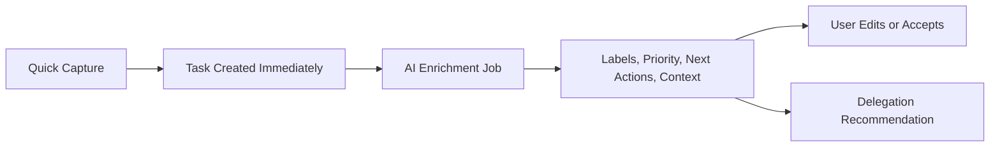

# Sifty MVP Plan

## Direction

Bootstrap Sifty as a responsive Next.js web app/PWA: one codebase works well on work laptop, personal laptop, and iPhone Safari, while leaving native iOS as a later wrapper if usage proves it worthwhile.

Recommended first stack:

- `app/` with Next.js App Router, TypeScript, Tailwind, and shadcn/ui using a calm dark-first product UI.
- Supabase Auth + Postgres + Realtime for sign-in, shared backend state, and cross-device updates.
- Drizzle for typed database access where server-side code needs stronger SQL control.
- Vercel AI SDK through AI Gateway for structured task triage, context retrieval, and future model routing/cost visibility.
- Trigger.dev for non-blocking AI enrichment jobs and future long-running delegation flows.
- Stripe for trials and subscriptions, with a creator override for `s.gonzalez.garza@gmail.com`.

## Product Shape

The core loop should be fast:

MVP screens:

- `Quick Add`: a primary button plus a flexible text area for "thing I need to do" and optional context/instructions in the same flow.
- `Today / Focus`: small set of high-signal tasks, with urgency, importance, energy/time size, and AI-generated next action.
- `Inbox`: newly captured or low-confidence tasks waiting for review.
- `Buckets`: urgent/important, scheduled, delegated, waiting, someday, personal, work, Cursor, errands, admin.
- `Task Detail`: editable title, description, labels, subtasks, next action, urgency/importance, estimated effort, context, AI rationale, and retry status.
- `Memory & Preferences`: simple controls for personal/work labels, working style, recurring context, and what AI should assume.
- `Billing`: trial/subscription status and usage limits for non-creator accounts.

## Data Model

Create schema under `db/schema` with these first tables:

- `users`: auth user mapping, email, display name, creator flag, created timestamps.
- `entitlements`: creator/free trial/subscriber state, trial end, Stripe customer/subscription IDs, AI quota tier.
- `tasks`: source text, title, description, status, urgency, importance, effort size, due date, project/context, delegation recommendation, confidence score, AI status.
- `task_labels`: user-owned labels such as `Cursor`, `Personal`, `Work`, `Errand`, `Admin`, `Demo Prep`.
- `subtasks`: ordered actionable steps with status.
- `task_events`: audit trail of user edits and AI updates.
- `memories`: durable user preferences and facts the AI may retrieve.
- `ai_runs`: prompt version, model, status, token/cost metadata, errors, retry count, and generated structured output.

Important invariant: task creation must only require `source_text`. Every AI-generated field is optional, editable, and traceable through `ai_runs`/`task_events`.

## AI Flow

Implement AI in `lib/ai` with versioned schemas and prompts:

- `triageTask`: convert raw input into title, description, GTD next action, labels, urgency/importance, effort size, due-date hints, subtasks, and delegation recommendation.
- `retrieveTaskContext`: pull bounded context from recent tasks, labels, user memories, and similar historical tasks.
- `askClarifyingQuestion`: only used when confidence is too low or action is ambiguous; cap at 1-3 sequential questions.
- `updateMemoryCandidates`: suggest durable preferences/facts after repeated patterns, but require user confirmation before writing important memories.

Use structured model output, strict runtime validation, prompt/version tracking, and retryable background jobs. The capture UI should show "AI organizing…" but never block navigation or editing.

## UI And UX Principles

Design for calm capture and progressive disclosure:

- Primary action is always available: mobile bottom action or desktop command/capture button.
- Use lists and focused views over a literal four-quadrant matrix; Eisenhower priority should inform sorting and badges, not dominate the UI.
- Default empty states should usually render nothing unless there is an action, such as connecting billing or adding the first task.
- Use skeletons, subtle status indicators, retry affordances, and task-level AI status.
- Keyboard-first desktop support: `Cmd+K`, quick add shortcut, arrow/j/k navigation, and real focus movement for accessibility.

## Billing And Limits

Implement entitlement checks centrally in `lib/entitlements`:

- If email is `s.gonzalez.garza@gmail.com`, grant unlimited creator AI usage without Stripe.
- For other users, create a 30-day trial on first sign-in.
- Track AI usage in `ai_runs` and enforce daily/monthly caps by entitlement tier.
- Stripe webhooks update `entitlements` transactionally.
- UI should degrade gracefully: manual task capture remains available even when AI limits are reached.

## Delegation Path

For MVP, do not automatically launch external coding/cloud agents yet. Instead:

- Have AI classify whether a task is suitable for AI, human delegation, or personal execution.
- Add a `Prepare for Agent` action that generates a clean brief/checklist for the user to review.
- Store the execution interface in a way that can later support Cursor/Linear/GitHub/Vercel integrations.

After MVP, add opt-in connectors for Cursor cloud agents, GitHub PRs, Linear issues, Slack/email/calendar ingestion, and demo-prep/release-digest automations.

## Implementation Phases

1. Bootstrap the app foundation: Next.js, Tailwind/shadcn, Supabase, auth, basic layout, PWA metadata.
2. Build schema and server boundaries: users, entitlements, tasks, labels, subtasks, memories, AI runs.
3. Ship instant capture: create task immediately, enqueue enrichment, render live status updates.
4. Ship AI triage: structured output, context retrieval, confidence scoring, editable AI fields, retries.
5. Ship task UX: inbox, focus list, task detail, labels, filters, mobile/desktop layouts, keyboard navigation.
6. Add billing and limits: Stripe trial/subscription state, creator override, quota enforcement.
7. Add delegation readiness: recommendation, brief generation, and manual execution handoff.

## Verification

After implementation starts, run the repo quality gate after code changes:

- `pnpm biome check --write`
- `pnpm tsc --noEmit`
- `pnpm build` when app routing, server/client boundaries, or deploy config changes require it.

Because this will change product behavior and data flow, run the repo's pre-push reviewer flow before calling the implementation complete.
